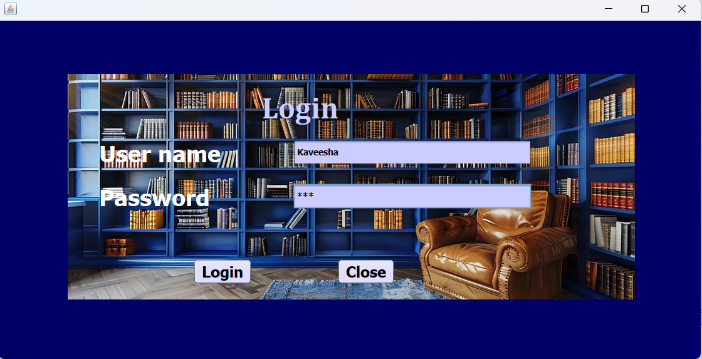
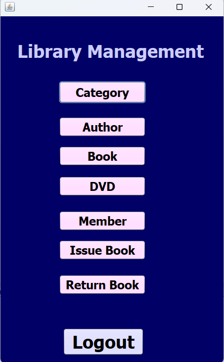
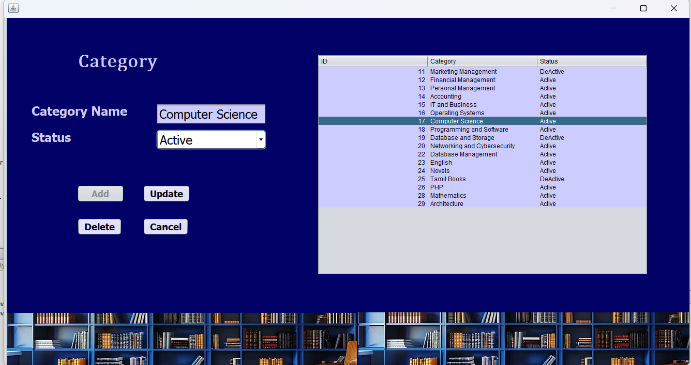
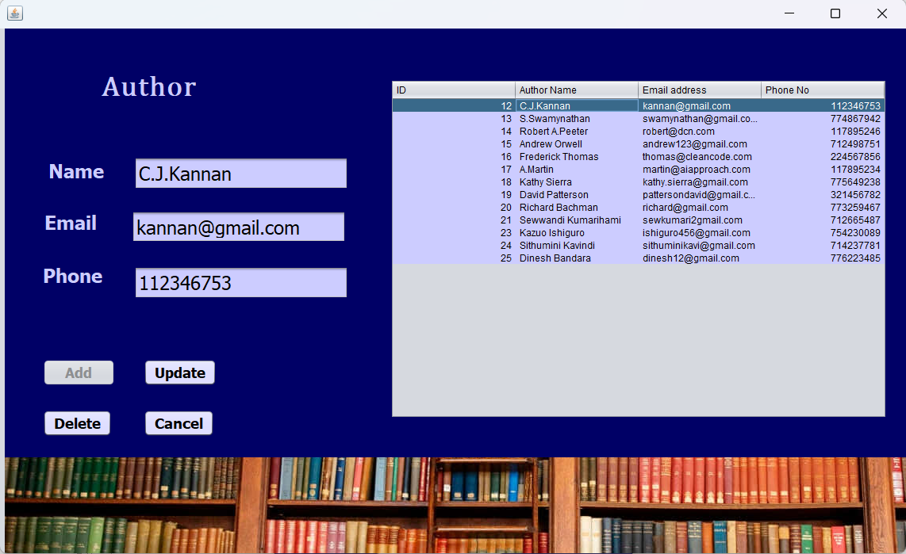
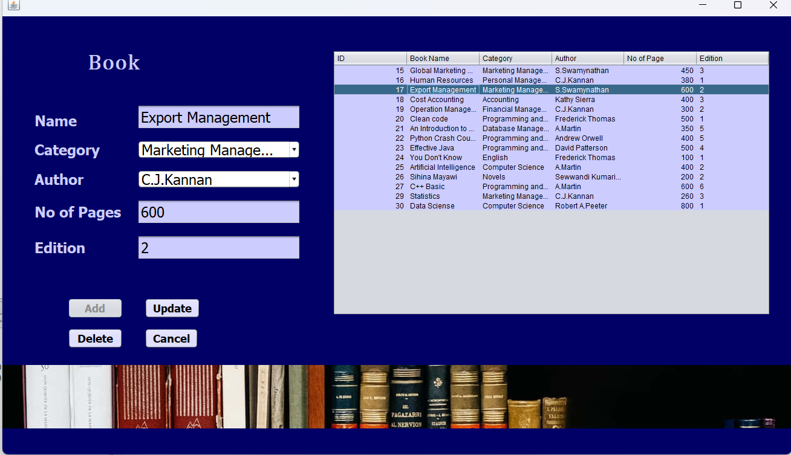
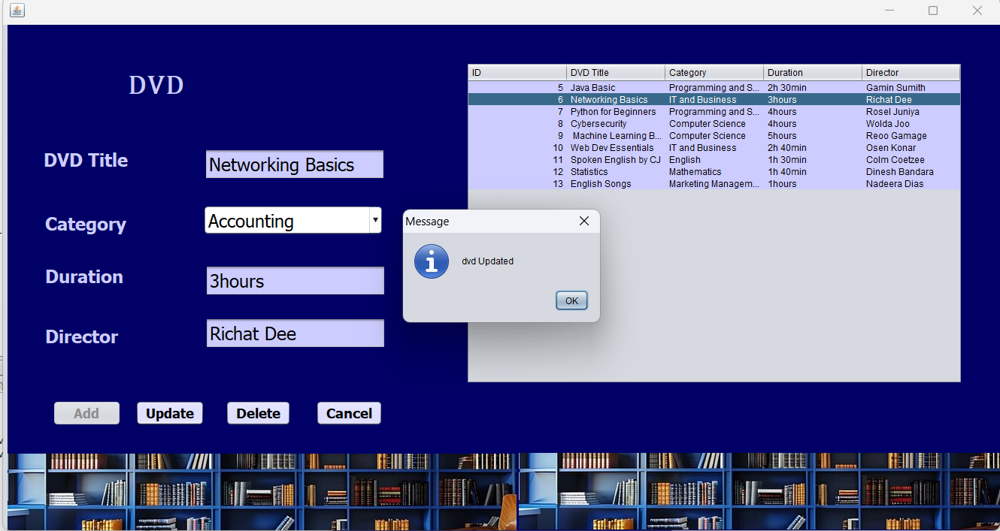
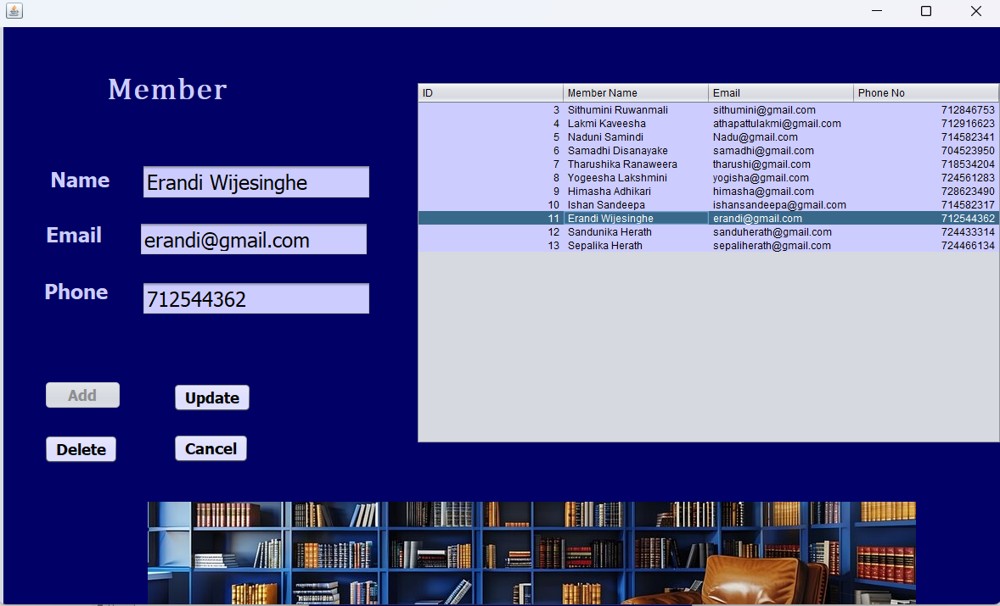
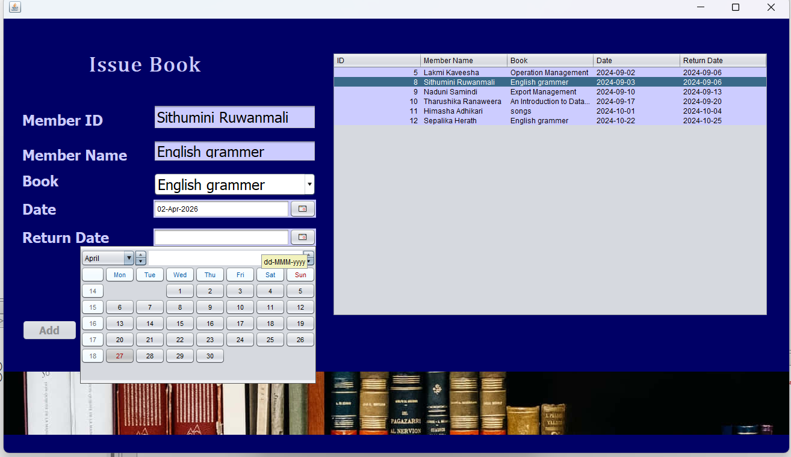
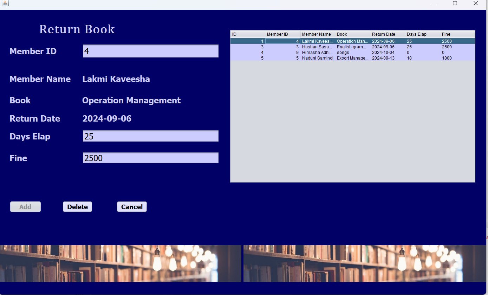

# 📚 Library Management System

A simple desktop application to manage library operations. It is built using Java Swing for the interface and MySQL for the database.

## 🚀 Project Overview
This project helps librarians to track books, DVDs, and members easily. It replaces manual record-keeping with a digital system to improve efficiency.

## 🔐 Login Details
To enter the system, use these credentials:

Username: Kaveesha
Password: 123

## 📌 Main Features
- Manage Items: Add, update, or remove Books and DVDs.

- Member Registration: Register new library members.

- Lending & Returns: Keep track of items borrowed by members and their return status.

- Organization: Categorize items by Author and Category.

## 🛠️ Tech Stack
- Language: Java

- GUI: Java Swing

- Database: MySQL (via XAMPP / phpMyAdmin)

- IDE: NetBeans

- Libraries: JDBC Connector, JCalendar

## 🎯 Learning Outcomes
- Understood how to connect a Java application to a database using JDBC.

- Learned to perform CRUD operations (Create, Read, Update, Delete).

- Practiced building a user-friendly interface with Java Swing.

## 📸 Screenshots

### Login Page

### Main Dashboard

### Category Page

### Author Page

### Book Page

### DVD Page

### Member Page

### Issue Book

### Return Book

